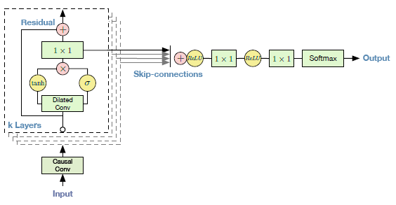
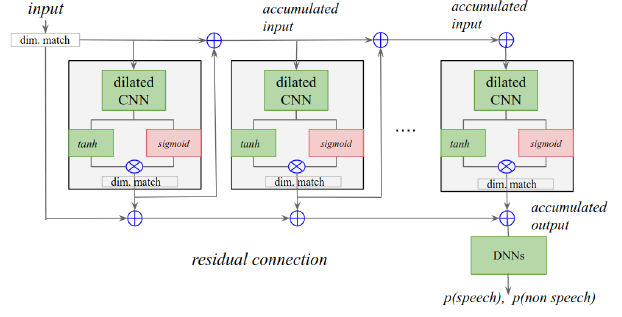

# WaveNet
## A WaveNet a variant of WaveNet implemented in Keras
This work implements the WaveNet network architecture and samll variant. The implementation is based on:
1. [WaveNet: : A Generative Model for Raw Audio](https://arxiv.org/pdf/1609.03499.pdf)
2. [Temporal Modeling Using Dilated Convolution and Fating for Voice-Activity-Detection](https://ai.google/research/pubs/pub47212)

_Both works have the same author: **_Aäron van den Oord_**_

## The models
Both models use a stack of WaveNet blocks (_**wavenet_block.py**_). _See **wavenet_and_variant.py**_

**Main differences:**

**WaveNet** [1]
| | |
|:-------------------------:|:-------------------------:|
| |
**WaveNet Architecture** _Image source_: [1]|

Predict next most likely value based on previous ones. Generat audio

1. Apply causal convolution to input
2. Use parameterized skip-connections
3. Output a softmax distribution (apply to parameterized skip-connecitons)

**Variant** (_Gated Dilated 1D Convolution with Residual connections_) [2]
| | |
|:-------------------------:|:-------------------------:|
| |
**Variant Architecture** _Image source_: [2]|

Asses the probability of input being speech or not.

1. Aplly dimension matching to input and stack's outputs
2. Residual connections (accumulated input and output) - _doesn't use skip-connections_
4. Aplly fully connected layer to stack's residual output
3. Output probability of **_speech_** and **_non-speech_**
